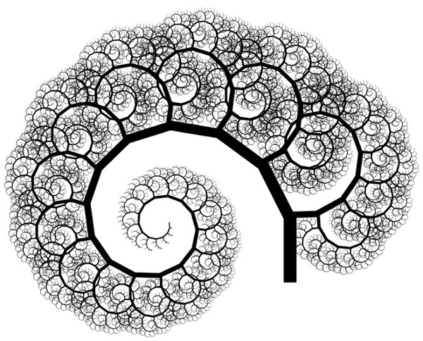

class: center, middle, inverse

# Are you an Egoistic Programmer?
[Agnieszka Matysek](http://womanonrails.com) at [Fractal Soft](http://fractalsoft.org)

---

class: middle, center, full-screen

.large-image[]

???

- **What do I do?** - I'm working in agriculture. Now my responsibility is to prepare algorithm which will check if crops have lodging risk. I'm working a lot with bad quality code in visual basic which now I rewrite in ruby. I work even with `goto` instruction. And I know why this is bad idea.
- **Why am I here?** - I love cleaning, I love refactoring sometimes even more then new feature, but there are very interesting feature which I would like to do.
- **Why title** - If you write bad code, you are egoistic programmer
- like CDR - only once you can write it, but in this can you cannot read it
- wasting time your and others (you will spend lot of hours trying to understand code)
- in most cases this is not problem with language but with programmer
- how many time did you write bade code
---

class: middle, center

.small-image[]

---

class: middle, center, spectial

.large-image[]

---

class: middle, center

.large-image[]

---

class: middle, center

.large-image[]

---

class: middle

.left-column[
# Agenda
- Introduction .green[&#10004;]
- Bad code examples
- Steps 14 of refactoring
- Summary
]
.right-column[
.thumb-image[]
]

???

- I cannot show you production code which I did for client
- NDA
- I will show you something what was written in 2011
- This code is not so bad, but it can be better
- It allow me to show some of practices which I use during my work

---

class: center, middle, inverse

# Examples

.small-image[]

---

class: middle

# What does this code?

```basic
For i = 1 To m1
For j = 1 To m1
If i <> j Then
s3(i, j) = 0
GoTo 410
End If
s3(i, j) = 1
410 Next j
Next i
```

---

class: middle

# Is it helpful?

```basic
For i = 1 To m1
  For j = 1 To m1
    If i <> j Then
      s3(i, j) = 0
      GoTo 410
    End If

  s3(i, j) = 1
  410 Next j
Next i
```

---

class: middle

# Maybe this?

```basic
m1 = 2

For i = 1 To m1
  For j = 1 To m1
    If i <> j Then
      s3(i, j) = 0
      GoTo 410
    End If

  s3(i, j) = 1
  410 Next j
Next i
```

---

class: middle

## Example

```basic
m1 = 2

For i = 1 To m1
  For j = 1 To m1
    If i <> j Then
      s3(i, j) = 0
      GoTo 410
    End If

  s3(i, j) = 1
  410 Next j
Next i
```

### Solution 1

```ruby
array = [
  [1, 0],
  [0, 1]
]
```

---

class: middle

## Example

```basic
m1 = 2

For i = 1 To m1
  For j = 1 To m1
    If i <> j Then
      s3(i, j) = 0
      GoTo 410
    End If

  s3(i, j) = 1
  410 Next j
Next i
```

### Solution 2

```basic
For i = 1 To m1
  For j = 1 To m1
    If i <> j Then s3(i, j) = 0
    If i = j Then s3(i, j) = 1
  Next j
Next i
```
---

class: middle

# Naming convention

```ruby
n12

n1n2
```
---

class: middle

# Naming convention

```ruby
n12 = n1 ^ 2
n1n2 = n1 * n2
```
## Rules (Clean Code)
- **N1** - Choose Descriptive Names
- **N5** - Use Long Names for Long Scopes

---

class: middle

# Naming convention

```ruby
field_ids
```

---

class: middle

# Naming convention

#### Bad
```ruby
field_ids = Field.pluck(:number)
```

#### Good
```ruby
field_ids = Field.pluck(:id)
```

---

class: center, middle, inverse

# Poker - refactoring

.small-image[]

---

class: tiny

```ruby
module Poker
  # Poker hand
  class Hand
    def check(array)
      array.sort!
      return 9 if straight_flush?(array)
      return 8 if four_of_a_kind?(array)
      return 7 if full_house?(array)
      return 6 if flush?(array)
      return 3 if two_pair?(array)
      return 2 if one_pair?(array)
      return 4 if three_of_a_kind?(array)
      return 5 if straight?(array)
      return 1 if high_card?(array)
      return 0
    end

    #Jeśli układ jest pokerem, numery kart modulo 4 są sobie równe
    def straight_flush?(array)
      if straight?(array) and flush?(array)
        return true
      else
        return false
      end
    end

    #jeśli mamy karetę, jeśli podzielę numery kart przez 4
    #4 pierwsze lub 4 ostatnie powinny być sobie równe
    def four_of_a_kind?(array)
      tmp = array.clone
      tmp.collect!{|x| x / 4 }

      helper_array = [0] * 13

      tmp.each do |elem|
        helper_array[elem] += 1
      end

      helper_array.delete(0)

      if helper_array.include?(4) and helper_array.include?(1)
        return true
      else
        return false
      end
    end

    def full_house?(array)
      tmp = array.clone
      tmp.collect!{|x| x / 4 }

      helper_array = [0] * 13

      tmp.each do |elem|
        helper_array[elem] += 1
      end

      helper_array.delete(0)

      if helper_array.include?(3) and helper_array.include?(2)
        return true
      else
        return false
      end
    end

    def flush?(array)
      tmp = array.clone
      tmp.collect!{|x| x % 4 }

      if tmp.uniq.length == 1
        return true
      else
        return false
      end
    end

    def straight?(array)
      if array.last / 4 == 12
        return straight_with_ace?(array)
      else
        return true_straight?(array)
      end
    end
```

---
class: tiny

.left-column-small-padding[
```ruby
    def straight_with_ace?(array)
      if true_straight?(array)
        return true
      else
        tmp = array.clone
        tmp.collect!{|x| x / 4}
        tmp.delete(12)

        sum = 0;
        tmp.each do |num|
          sum += num
        end

        if sum == 6
          return true
        else
          return false
        end
      end
    end

    def true_straight?(array)
      tmp = array.clone
      minimum_card = tmp[0] / 4

      tmp.collect!{|x| x / 4 - minimum_card}

      sum = 0;
      tmp.each do |num|
        sum += num
      end

      if sum == 10
        return true
      else
        return false
      end
    end

    def three_of_a_kind?(array)
      tmp = array.clone
      tmp.collect!{|x| x / 4 }

      helper_array = [0] * 13

      tmp.each do |elem|
        helper_array[elem] += 1
      end

      helper_array.delete(0)

      if helper_array.include?(3) and helper_array.include?(1)
        return true
      else
        return false
      end
    end

    def two_pair?(array)
      tmp = array.clone
      tmp.collect!{|x| x / 4 }

      helper_array = [0] * 13

      tmp.each do |elem|
        helper_array[elem] += 1
      end

      helper_array.delete(0)

      if helper_array.include?(2) and helper_array.length == 3
        return true
      else
        return false
      end
    end
```
]
.right-column[
```ruby
    def one_pair?(array)
      tmp = array.clone
      tmp.collect!{|x| x / 4 }

    #  (0..8).each do |elem|
    #    tmp.delete(elem)
    #  end

      helper_array = [0] * 13

      tmp.each do |elem|
        helper_array[elem] += 1
      end

      helper_array.delete(0)

      if helper_array.include?(2)
        return true
      else
        return false
      end
    end

    def high_card?(array)
      if array.last >= 36
        return true
      else
        return false
      end
    end
  end
end
```
.small[[All code here](https://github.com/womanonrails/poker/blob/55c9ae0ab921f7aa95bb7e47676d87b970a32033/lib/poker/hand.rb)]
]
---

class: middle

# Stats

- **LOC** - 194
- **LOT** - 168
- **Flog** - 112.8
- **Flay** - 123
- **Tests** - 12 examples, 0 failures

---

class: middle, center

# Step 1 - First clean ups

.small-image[]

---

class: middle

# Step 1 - First clean ups

#### Code before change:

```ruby
def straight_flush?(array)
  if straight?(array) and flush?(array)
    return true
  else
    return false
  end
end
```

#### Code after change:

```ruby
def straight_flush?(array)
  straight?(array) && flush?(array)
end
```

---

class: middle, center

# Step 2 - Understand logic and simplify

.small-image[]

---

class: middle

# Poker cards

<table class='table'>
  <tbody>
    <tr>
      <td>0 </td> <td>2&spades;</td>
      <td>4 </td> <td>3&spades;</td>
      <td>8 </td> <td>4&spades;</td>
      <td>12</td> <td>5&spades;</td>
      <td>16</td> <td>6&spades;</td>
      <td>20</td> <td>7&spades;</td>
      <td>24</td> <td>8&spades;</td>
    </tr>
    <tr>
      <td>1 </td> <td>2&clubs;</td>
      <td>5 </td> <td>3&clubs;</td>
      <td>9 </td> <td>4&clubs;</td>
      <td>13</td> <td>5&clubs;</td>
      <td>17</td> <td>6&clubs;</td>
      <td>21</td> <td>7&clubs;</td>
      <td>25</td> <td>8&clubs;</td>
    </tr>
    <tr>
      <td>2 </td> <td class='red'>2&hearts;</td>
      <td>6 </td> <td class='red'>3&hearts;</td>
      <td>10</td> <td class='red'>4&hearts;</td>
      <td>14</td> <td class='red'>5&hearts;</td>
      <td>18</td> <td class='red'>6&hearts;</td>
      <td>22</td> <td class='red'>7&hearts;</td>
      <td>26</td> <td class='red'>8&hearts;</td>
    </tr>
    <tr>
      <td>3 </td> <td class='red'>2&diams;</td>
      <td>7 </td> <td class='red'>3&diams;</td>
      <td>11</td> <td class='red'>4&diams;</td>
      <td>15</td> <td class='red'>5&diams;</td>
      <td>19</td> <td class='red'>6&diams;</td>
      <td>23</td> <td class='red'>7&diams;</td>
      <td>27</td> <td class='red'>8&diams;</td>
    </tr>
  </tbody>
</table>

<br>

<table class='table'>
  <tbody>
    <tr>
      <td>28</td> <td>9&spades;</td>
      <td>32</td> <td>10&spades;</td>
      <td>36</td> <td>J&spades;</td>
      <td>40</td> <td>D&spades;</td>
      <td>44</td> <td>K&spades;</td>
      <td>48</td> <td>A&spades;</td>
    </tr>
    <tr>
      <td>29</td> <td>9&clubs;</td>
      <td>33</td> <td>10&clubs;</td>
      <td>37</td> <td>J&clubs;</td>
      <td>41</td> <td>D&clubs;</td>
      <td>45</td> <td>K&clubs;</td>
      <td>49</td> <td>A&clubs;</td>
    </tr>
    <tr>
      <td>30</td> <td class='red'>9&hearts;</td>
      <td>34</td> <td class='red'>10&hearts;</td>
      <td>38</td> <td class='red'>J&hearts;</td>
      <td>42</td> <td class='red'>D&hearts;</td>
      <td>46</td> <td class='red'>K&hearts;</td>
      <td>50</td> <td class='red'>A&hearts;</td>
    </tr>
    <tr>
      <td>31</td> <td class='red'>9&diams;</td>
      <td>35</td> <td class='red'>10&diams;</td>
      <td>39</td> <td class='red'>J&diams;</td>
      <td>43</td> <td class='red'>D&diams;</td>
      <td>47</td> <td class='red'>K&diams;</td>
      <td>52</td> <td class='red'>A&diams;</td>
    </tr>
  </tbody>
</table>

---

class: middle

# Step 2 - Understand logic and simplify

#### Code before change:

```ruby
def one_pair?(array)
  tmp = array.clone
  tmp.collect!{|x| x / 4 }

#  (0..8).each do |elem|
#    tmp.delete(elem)
#  end

  helper_array = [0] * 13

  tmp.each do |elem|
    helper_array[elem] += 1
  end

  helper_array.delete(0)

  helper_array.include?(2)
end
```

---
class: middle

# Step 2 - Understand logic and simplify

#### Code after:

```ruby
def one_pair?(array)
  hash = Hash.new(0)
  array.each { |item| hash[item / 4] += 1 }
  hash.values.include?(2)
end
```
---

class: middle

## Repeat for all methods

1. Took method and remove content
2. Run test (some tests are failing), understand logic
3. Write new code in simpler way
4. Check tests

---

class: middle

.left-column[

## Old stats
- **LOC** - .red[194]
- **LOT** - .red[168]
- **Flog** - .red[112.8]
- **Flay** - .red[123]
- **Tests** - 12 examples, 0 failures
]

.right-column-small-padding[
## New stats

- **LOC** - .green[73]
- **LOT** - .green[170]
- **Flog** - .green[76.3]
- **Flay** - .green[63]
- **Tests** - 12 examples, 0 failures
]

---

class: middle, center

# Step 3 - From procedural to more OOP

.small-image[]

---

class: middle

# Step 3 - From procedural to more OOP

#### Array everywhere

```ruby
def three_of_a_kind?(array)
  hash = Hash.new(0)
  array.each { |item| hash[item / 4] += 1 }
  hash.values.include?(3)
end
```

???

- in many places we use `array.each { |item| hash[item / 4] += 1 }`
- everywhere we put as argument `array`

---

class: middle

#### Add initializer

```ruby
def initialize(array)
  @array = array.sort
  @cards = @array.map { |item| item / 4 }
end
```

#### Before
```ruby
def three_of_a_kind?(array)
  hash = Hash.new(0)
  array.each { |item| hash[item / 4] += 1 }
  hash.values.include?(3)
end
```

#### After
```ruby
def three_of_a_kind?
  hash = Hash.new(0)
  @cards.each { |item| hash[item] += 1 }
  hash.values.include?(3)
end
```

???

- we add initializer
- declare `@array` and `@cards`
- we use `@cards` instead of `array`
- we remove argument from all methods
- refactoring in tests, now each test has one expect

---

class: tiny, middle

```ruby
class Hand
  def initialize(array)
    @array = array.sort
    @carts = @array.map { |item| item / 4 }
  end

  def check
    return 9 if straight_flush?
    return 8 if four_of_a_kind?
    return 7 if full_house?
    return 6 if flush?
    return 5 if straight?
    return 4 if three_of_a_kind?
    return 3 if two_pair?
    return 2 if one_pair?
    return 1 if high_card?
    return 0
  end

  def straight_flush?
    straight? && flush?
  end

  def four_of_a_kind?
    hash = Hash.new(0)
    @carts.each { |item| hash[item] += 1 }
    hash.values.include?(4)
  end

  def full_house?
    three_of_a_kind? && one_pair?
  end

  def flush?
    color = @array.map { |item| item % 4 }
    color.uniq.size == 1
  end

  def normal_straight?
    @carts.each_cons(2) do |previous, current|
      return false unless previous + 1 == current
    end
    true
  end

  def straight?
    [0, 1, 2, 3, 12] == @carts || normal_straight?
  end

  def three_of_a_kind?
    hash = Hash.new(0)
    @carts.each { |item| hash[item] += 1 }
    hash.values.include?(3)
  end

  def two_pair?
    hash = Hash.new(0)
    @carts.each { |item| hash[item] += 1 }
    (hash.values - [2]).size == 1
  end

  def one_pair?
    hash = Hash.new(0)
    @carts.each { |item| hash[item] += 1 }
    hash.values.include?(2)
  end

  def high_card?
    @array.last >= 36
  end
end
```

---

class: middle

.left-column[
## Old stats
- **LOC** - .green[73]
- **LOT** - .red[170]
- **Flog** - .red[76.3]
- **Flay** - .red[63]
- **Tests** - 12 examples, 0 failures
]

.right-column-small-padding[
## New stats

- **LOC** - .red[76]
- **LOT** - .green[190]
- **Flog** - .green[70.9]
- **Flay** - .green[57]
- **Tests** - 104 examples, 0 failures
]

---

class: middle, center

# Step 4 - Remove duplication

.small-image[]

---

class: middle

# Step 4 - Remove duplication

```ruby
def three_of_a_kind?
  hash = Hash.new(0)
  @cards.each { |item| hash[item] += 1 }
  hash.values.include?(3)
end
```

---

class: middle

# Step 4 - Remove duplication

#### Change initializer

```ruby
def initialize(array)
  @array = array.sort
  @cards = @array.map { |item| item / 4 }
  @frequency = cards_frequency
end
```

#### New method

```ruby
def cards_frequency
  hash = Hash.new(0)
  @cards.each { |item| hash[item] += 1 }
  hash.values
end
```

???

- based on Reek
- many `@cards.each { |item| hash[item] += 1 }`

---

class: middle

# Step 4 - Remove duplication

#### Before

```ruby
def four_of_a_kind?
  hash = Hash.new(0)
  @cards.each { |item| hash[item] += 1 }
  hash.values.include?(4)
end
```

#### After

```ruby
def four_of_a_kind?
  @frequency.include?(4)
end
```

---

class: middle

.left-column[
## Old stats
- **LOC** - .red[76]
- **LOT** - 190
- **Flog** - .red[70.9]
- **Flay** - .red[57]
- **Tests** - 104 examples, 0 failures
]

.right-column-small-padding[
## New stats

- **LOC** - .green[75]
- **LOT** - 190
- **Flog** - .green[59.9]
- **Flay** - .green[0]
- **Tests** - 104 examples, 0 failures
]

---

class: middle, center

# Step 5 - small public interface

.small-image[]
---

class: middle, tiny

# Step 5 - small public interface

```ruby
class Hand
  def initialize(array)
    @array = array.sort
    @cards = @array.map { |item| item / 4 }
    @frequency = cards_frequency
  end

  def cards_frequency
    hash = Hash.new(0)
    @cards.each { |item| hash[item] += 1 }
    hash.values
  end

  def check
    return 9 if straight_flush?
    return 8 if four_of_a_kind?
    return 7 if full_house?
    return 6 if flush?
    return 5 if straight?
    return 4 if three_of_a_kind?
    return 3 if two_pair?
    return 2 if one_pair?
    return 1 if high_card?
    return 0
  end

  def straight_flush?
    straight? && flush?
  end

  def four_of_a_kind?
    @frequency.include?(4)
  end

  def full_house?
    three_of_a_kind? && one_pair?
  end

  def flush?
    color = @array.map { |item| item % 4 }
    color.uniq.size == 1
  end

  def normal_straight?
    @cards.each_cons(2) do |previous, current|
      return false unless previous + 1 == current
    end
    true
  end

  def straight?
    [0, 1, 2, 3, 12] == @cards || normal_straight?
  end

  def three_of_a_kind?
    @frequency.include?(3)
  end

  def two_pair?
    (@frequency - [2]).size == 1
  end

  def one_pair?
    @frequency.include?(2)
  end

  def high_card?
    @array.last >= 36
  end
end
```

---

class: middle

# Step 5 - small public interface

```ruby
[
  [0, 4, 8, 12, 16],
  [5, 9, 13, 17, 21],
  [10, 14, 18, 22, 26],
  [15, 19, 23, 27, 31],
  [16, 20, 24, 28, 32],
  [37, 29, 33, 21, 25].shuffle,
  [30, 34, 38, 26, 42].shuffle,
  [31, 35, 47, 43, 39].shuffle,
  [32, 48, 40, 44, 36].shuffle,
  [49, 45, 41, 37, 33].shuffle
].each do |cards|
  it "detects straight_flush for #{cards}" do
    hand = described_class.new(cards)
    expect(hand.check).to eq 9
  end
end
```

---

class: middle

.left-column[
## Old stats
- **LOC** - .green[76]
- **LOT** - 190
- **Flog** - .green[61.0]
- **Flay** - 0
- **Tests** - 104 examples, 0 failures
]

.right-column-small-padding[
## New stats

- **LOC** - .red[77]
- **LOT** - 190
- **Flog** - .green[59.9]
- **Flay** - 0
- **Tests** - 104 examples, 0 failures
]

???

- big public interface is hard to maintain
- test are checking only method `check`
- I decide to declare all others method as private

---

class: middle, center

# Step 6 - more clean ups

.small-image[]


???

- step similar to step 4
- remove duplications
- change names
- new method `cards_figures_and_colors`
- refactoring in `cards_frequency`

---

class: middle

# Step 6 - more clean ups

#### Add method:

```ruby
def cards_figures_and_colors
  @array.map { |item| [item / 4, item % 4] }.transpose
end
```

#### Used in initializer

```ruby
def initialize(array)
  @array = array.sort
  @figures, @colors = cards_figures_and_colors
  @frequency = cards_frequency.values
end
```

---

class: middle

# Step 6 - more clean ups

#### Before

```ruby
def cards_frequency
  hash = Hash.new(0)
  @cards.each { |item| hash[item] += 1 }
  hash.values
end
```

#### After

```ruby
def cards_frequency
  @figures.each_with_object(Hash.new(0)) do |item, hash|
    hash[item] += 1
  end
end
```

---

class: middle

# Step 6 - more clean ups

#### Before

```ruby
def flush?
  color = @array.map { |item| item % 4 }
  color.uniq.size == 1
end
```

#### After

```ruby
def flush?
  @colors.uniq.size == 1
end
```

---

class: middle

.left-column[
## Old stats
- **LOC** - .green[77]
- **LOT** - 190
- **Flog** - .green[59.9]
- **Flay** - 0
- **Tests** - 104 examples, 0 failures
]

.right-column-small-padding[
## New stats

- **LOC** - .red[80]
- **LOT** - 190
- **Flog** - .red[64.5]
- **Flay** - 0
- **Tests** - 104 examples, 0 failures
]

---

class: middle, center

# Step 7 - More descriptive output

.small-image[]

---

class: middle

# Step 7 - More descriptive output

#### Before

```ruby
def check
  return 9 if straight_flush?
  return 8 if four_of_a_kind?
  return 7 if full_house?
  return 6 if flush?
  return 5 if straight?
  return 4 if three_of_a_kind?
  return 3 if two_pair?
  return 2 if one_pair?
  return 1 if high_card?
  return 0
end
```
---

class: middle

# Step 7 - More descriptive output

#### After

```ruby
def check
  return :straight_flush if straight_flush?
  return :four_of_a_kind if four_of_a_kind?
  return :full_house if full_house?
  return :flush if flush?
  return :straight if straight?
  return :three_of_a_kind if three_of_a_kind?
  return :two_pair if two_pair?
  return :one_pair if one_pair?
  return :high_card if high_card?
  return :none
end
```
---

class: middle

.left-column[
## Old stats
- **LOC** - 80
- **LOT** - 190
- **Flog** - .red[64.5]
- **Flay** - 0
- **Tests** - 104 examples, 0 failures
]

.right-column-small-padding[
## New stats

- **LOC** - 80
- **LOT** - 190
- **Flog** - .green[62.5]
- **Flay** - 0
- **Tests** - 104 examples, 0 failures
]

---

class: middle, center

# Step 8 - Meta-programming

.small-image[]

---

class: middle

# Step 8 - Meta-programming

#### Code before:

```ruby
def check
  return :straight_flush if straight_flush?
  return :four_of_a_kind if four_of_a_kind?
  return :full_house if full_house?
  return :flush if flush?
  return :straight if straight?
  return :three_of_a_kind if three_of_a_kind?
  return :two_pair if two_pair?
  return :one_pair if one_pair?
  return :high_card if high_card?
  return :none
end
```

---

class: middle

# Step 8 - Meta-programming

#### Add to initializer

```ruby
@order_checking = [
  :straight_flush, :four_of_a_kind, :full_house, :flush, :straight,
  :three_of_a_kind, :two_pair, :one_pair, :high_card, :none
]
```

#### Code after:

```ruby
def check
  @order_checking.each do |name|
    method_name = (name.to_s + '?').to_sym
    return name if send(method_name)
  end
end
```
---

class: middle

.left-column[
## Old stats
- **LOC** - .green[80]
- **LOT** - 190
- **Flog** - .red[62.5]
- **Flay** - 0
- **Tests** - 104 examples, 0 failures
]

.right-column-small-padding[
## New stats

- **LOC** - .red[82]
- **LOT** - 190
- **Flog** - .green[59.3]
- **Flay** - 0
- **Tests** - 104 examples, 0 failures
]

---

class: middle, center

# Step 9 - Small object

.small-image[]

---

class: middle

# Step 9 - Small object

#### Move logic to separate class

```ruby
module Poker
  class FourOfAKind
    def initialize(array)
      @array = array.sort
      @figures, @colors = cards_figures_and_colors
      @frequency = cards_frequency.values
    end

    def check
      :four_of_a_kind if @frequency.include?(4)
    end

    private

    def cards_figures_and_colors
      @array.map { |item| [item / 4, item % 4] }.transpose
    end

    def cards_frequency
      @figures.each_with_object(Hash.new(0)) do |item, hash|
        hash[item] += 1
      end
    end
  end
end
```

---

class: middle

# Step 9 - Small object

#### Create/modify `if` statement

```ruby
def check
  @order_checking.each do |name|
    if name == :four_of_a_kind
      return name if FourOfAKind.new(@array).check == name
    else
      method_name = (name.to_s + '?').to_sym
      return name if send(method_name)
    end
  end
end
```

---

class: middle

# Step 9 - Small object

#### Prepare tests for new class

```ruby
require 'spec_helper'

describe Poker::FourOfAKind do
  [
    [0, 1, 2, 3, 4],
    [4, 5, 6, 0, 7],
    [8, 9, 0, 10, 11],
    [12, 0, 13, 14, 15],
    [0, 16, 17, 18, 19],
    [20, 21, 22, 23, 0].shuffle,
    [24, 25, 26, 27, 0].shuffle,
    [28, 29, 30, 31, 0].shuffle,
    [32, 33, 34, 35, 0].shuffle,
    [36, 37, 38, 39, 0].shuffle
  ].each do |cards|
    it "detects four_of_a_kind for #{cards}" do
      hand = described_class.new(cards)
      expect(hand.check).to eq :four_of_a_kind
    end
  end
end
```

---

class: middle

# Step 9 - Small object

1. Move logic to separate class
2. Create/modify `if` statement
3. Prepare tests for new class

---

class: middle

### Extra step

```ruby
ORDER_CHECKING = [
  :straight_flush, :four_of_a_kind, :full_house, :flush, :straight,
  :three_of_a_kind, :two_pair, :one_pair, :high_card, :none
]

def initialize(array, order_checking = ORDER_CHECKING)
  @array = array.sort
  @figures, @colors = cards_figures_and_colors
  @frequency = cards_frequency.values
  @order_checking = order_checking
end
```

---

class: middle

.left-column[

## Old stats
- **LOC** - .green[82]
- **LOT** - .red[190]
- **Flog** - .green[59.3]
- **Flay** - 0
- **Tests** - 104 examples, 0 failures
]

.right-column-small-padding[
## New stats

- **LOC** - .red[85]
- **LOT** - .green[200]
- **Flog** - .red[65.5]
- **Flay** - 0
- **Tests** - 116 examples, 0 failures
]

???

- calculation only for `Hand` class

---

class: middle, center

# Step 10 - Remove duplication

.small-image[]

---

class: middle

# Step 10 - Remove duplication

```ruby
class Normalization
  attr_reader :figures, :colors, :figures_frequency

  def initialize(array)
    @array = array.sort
    @figures = prepare_figures
    @colors = prepare_colors
    @figures_frequency = prepare_figures_frequency.values
  end

  private

  def prepare_colors
    @array
  end

  def prepare_figures
    @array
  end

  def prepare_figures_frequency
    @figures.each_with_object(Hash.new(0)) do |item, hash|
      hash[item] += 1
    end
  end
end

```

---

class: middle

# Step 10 - Remove duplication

```ruby
class CardsNormalization < Normalization
  private

  def prepare_colors
    @array.map { |item| item % 4 }
  end

  def prepare_figures
    @array.map { |item| item / 4 }
  end
end

```
---

class: middle

# Step 10 - Remove duplication

#### Inject normalization class

```ruby
def initialize(
  array, order_checking = ORDER_CHECKING, normalization = CardsNormalization
)
```

#### Example of class after refactoring

```ruby
module Poker
  class OnePair
    def initialize(array, normalization = Normalization)
      @normalize_array = normalization.new(array)
    end

    def check
      :one_pair if @normalize_array.figures_frequency.include?(2)
    end
  end
end
```

---

class: middle

# Step 10 - Remove duplication

#### More complex `check` method

```ruby
def check
  @order_checking.each do |name|
    if [:one_pair].include? name
      class_name  = 'Poker::' + name.to_s.split('_').collect(&:capitalize).join
      if Object.const_get(class_name).new(@array, @normalization).check == name
        return name
      end
    end
    if [:four_of_a_kind, :three_of_a_kind, :one_pair].include? name
      class_name  = 'Poker::' + name.to_s.split('_').collect(&:capitalize).join
      return name if Object.const_get(class_name).new(@array).check == name
    else
      method_name = (name.to_s + '?').to_sym
      return name if send(method_name)
    end
  end
end
```
---

class: middle

.left-column[
## Old stats
- **LOC** - .green[85]
- **LOT** - 200
- **Flog** - .green[65.5]
- **Flay** - 0
- **Tests** - 116 examples, 0 failures
]

.right-column-small-padding[
## New stats

- **LOC** - .red[87]
- **LOT** - 200
- **Flog** - .red[82.5]
- **Flay** - 0
- **Tests** - 124 examples, 0 failures
]

???

- calculation only for `Hand` class

---

class: middle, center

# Step 11 - Remove more duplications

.small-image[]

---

class: middle

# Step 11 - Remove more duplications

```ruby
module Poker
  class OnePair
    def initialize(array, normalization = Normalization)
      @normalize_array = normalization.new(array)
    end

    def check
      :one_pair if @normalize_array.figures_frequency.include?(2)
    end
  end
end
```

???

- check out one more time existing code
- duplication is here `@normalize_array.figures_frequency.include?(2)`

---

class: middle

# Step 11 - Remove more duplications

#### Create class for rule
```ruby
module Rules
  class FrequencyRule
    def initialize(frequency_array, count)
      @frequency_array = frequency_array
      @count = count
    end

    def check?
      @frequency_array.include?(@count)
    end
  end
end
```

---

class: middle

# Step 11 - Remove more duplications

#### Refactoring in existing classes
```ruby
class ThreeOfAKind
  def initialize(array, normalization = Normalization)
    @normalize_array = normalization.new(array)
    @rule = Rules::FrequencyRule.new(@normalize_array.figures_frequency, 3)
  end

  def check
    :three_of_a_kind if @rule.check?
  end
end
```

---

class: middle

.left-column[
## Old stats
- **LOC** - 87
- **LOT** - .green[200]
- **Flog** - 82.5
- **Flog total** - .green[122.4]
- **Flay** - 0
- **Tests** - 124 examples, 0 failures
]

.right-column-small-padding[
## New stats

- **LOC** - 87
- **LOT** - .red[161]
- **Flog** - 82.5
- **Flog total** - .red[134.9]
- **Flay** - 0
- **Tests** - 95 examples, 0 failures
]

???

- calculation only for `Hand` class

---

class: middle, center

# Step 12 - Combining rules

.small-image[]

---

class: middle

# Step 12 - Combining rules

```ruby
class RulesFactory
  def initialize(*rules)
    @rules = rules
  end

  def check?
    @rules.each do |rule|
      return false unless rule.check?
    end
    true
  end
end
```

---

class: middle

# Step 12 - Combining rules

```ruby
module Poker
  class FullHouse
    def initialize(array, normalization = Normalization)
      @normalize_array = normalization.new(array)
      rule1 = Rules::FrequencyRule.new(@normalize_array.figures_frequency, 2)
      rule2 = Rules::FrequencyRule.new(@normalize_array.figures_frequency, 3)
      @rules = RulesFactory.new(rule1, rule2)
    end

    def check
      :full_house if @rules.check?
    end
  end
end
```

---

class: middle

# Step 12 - Combining rules

### Repeat step

1. Extract rule if it's needed
2. Prepare tests
3. Add class for new cards order
4. Use rule in that class
5. Prepare tests

### Repeat for

- `StraightnessRule`, `FlushnessRule` or `RoyalnessRule`
- `Straight`, `Flush` or `RoyalFlush`

---

class: middle

.left-column[
## Old stats
- **LOC** - .green[87]
- **LOT** - .red[161]
- **Flog** - .red[82.5]
- **Flog total** - .green[134.9]
- **Flay** - 0
- **Tests** - 95 examples, 0 failures
]

.right-column-small-padding[
## New stats

- **LOC** - .red[94]
- **LOT** - .green[171]
- **Flog** - .green[69.7]
- **Flog total** - .red[191.2]
- **Flay** - 0
- **Tests** - 142 examples, 0 failures
]

???

- calculation only for `Hand` class
class: middle

---

class: middle

# Unexpected use

.position-absolute[.thumb-image[]]

```ruby
module Rules
  class FlushnessRule
    def initialize(color_array)
      @color_array = color_array
    end
    def check?
      @color_array.uniq.size == 1
    end
  end
end
```

---

class: middle

# Unexpected use

.position-absolute[.thumb-image[]]

#### What we check
```irb
rule = FlushnessRule.new([1,1])
 => #<FlushnessRule:0x00000001eced60 @color_array=[1, 1]>
rule.check?
 => true
```

#### What we can use
```irb
rule = FlushnessRule.new(['#fff','#fff'])
 => #<FlushnessRule:0x00000001ebc020 @color_array=["#fff", "#fff"]>
rule.check?
 => true
```

???

- this class is so simple that we can easily understand
- we can also use this in different ways
- [**duck typing**](https://en.wikipedia.org/wiki/Duck_typing)

---

class: middle, center

# Step 13 - Rule for nothing

.small-image[]

---

class: middle

# Step 13 - Rule for nothing

```ruby
module Poker
  class None
    def initialize(array, normalization = Normalization)
      @normalize_array = normalization.new(array)
    end

    def check
      :none
    end
  end
end
```

---

class: middle

.left-column[
## Old stats
- **LOC** - .red[94]
- **LOT** - 171
- **Flog** - .red[69.7]
- **Flog total** - .red[191.2]
- **Flay** - 0
- **Tests** - 142 examples, 0 failures
]

.right-column-small-padding[
## New stats

- **LOC** - .green[55]
- **LOT** - 171
- **Flog** - .green[56.0]
- **Flog total** - .green[180.8]
- **Flay** - 0
- **Tests** - 145 examples, 0 failures
]

???

- calculation only for `Hand` class
class: middle

---

class: middle, center

# Step 14 - At the end

.small-image[]

---

class: middle

# Step 14 - MultiFrequencyRule

```ruby
module Rules
  class MultiFrequencyRule
    def initialize(frequency_array, count, times = 1)
      @frequency_array = frequency_array
      @count = count
      @times = times
    end

    def check?
      selected_frequency = @frequency_array.reject { |number| number < @count }
      selected_frequency.count >= @times
    end
  end
end
```

---

class: middle

# Step 14 - MultiFrequencyRule

```ruby
def check?
  selected_frequency = @frequency_array.map { |number| number / @count }
  selected_frequency.sum >= @times
end
```

---

class: middle, small

# Step 14 - The End

```ruby
module Poker
  ORDER_CHECKING = [
    :royal_flush, :straight_flush, :four_of_a_kind, :full_house, :flush,
    :straight, :three_of_a_kind, :two_pair, :one_pair, :high_card, :none
  ].freeze

  # Poker hand
  class Hand
    def initialize(
      array,
      order_checking = ORDER_CHECKING,
      normalization = CardsNormalization
    )
      @array = array.sort
      @order_checking = order_checking
      @normalization = normalization
    end

    def check
      @order_checking.each do |name|
        return name if class_name(name).check == name
      end
    end

    private

    def class_name(name)
      class_name = 'Poker::' + name.to_s.split('_').collect(&:capitalize).join
      Object.const_get(class_name).new(@array, @normalization)
    end
  end
end
```
---

class: middle

.left-column[
## Old stats
- **LOC** - .red[55]
- **LOT** - .red[171]
- **Flog** - .red[56.0]
- **Flog total** - .green[180.8]
- **Flay** - 0
- **Tests** - 145 examples, 0 failures
]

.right-column-small-padding[
## New stats

- **LOC** - .green[37]
- **LOT** - .green[173]
- **Flog** - .green[28.0]
- **Flog total** - .red[182.4]
- **Flay** - 0
- **Tests** - 145 examples, 0 failures
]

???

- calculation only for `Hand` class
class: middle

---
class: middle

.left-column[
## First stats

- **LOC** - .red[194]
- **LOT** - .red[168]
- **Flog** - .red[112.8]
- **Flog total** - .green[112.8]
- **Flay** - .red[123]
- **Tests** - 12 examples, 0 failures
]

.right-column-small-padding[
## Last stats
- **LOC** - .green[37]
- **LOT** - .green[173]
- **Flog** - .green[28.0]
- **Flog total** - .red[182.4]
- **Flay** - .green[0]
- **Tests** - 145 examples, 0 failures
]

---

class: middle, center

# Is it really end? What next?

.small-image[]


???

- refactoring never ends
- always is something to improve
- now we know all what we can, but in future we will know more
- hands classes are very generic, I will remove them
- create only one class which combining rules inside
- name and rules as arguments in initializer
- prepare some configuration which will create code like we want
- all logic drive by configuration class

---

class: middle

# What does this refactoring give to me?

- small, readable and easy to test classes
- quite big flexibility
- less dependences
- we are open to extension
- it was fun ;]

???

- I can use code in many different ways, not only for checking poker hand
- I can use it in dices
- we can easily add or remove some rules
- we don't need to modify existing code to add more rules, we need to add new classes and prepare right configuration.
- We can also use convention and do this automatically, so if someone add new class everything will be working with new functionality without configuration.

---

class: middle

# Summary

- This are some ideas for refactoring
- Work with tests
- Always after each change keep tests passing
- Start small then go to details
- Do not change everything at one time
- Your code should not need comments
- Tools & metrics are useful but sometimes are wrong
- Track you duplication, they force you to think of new architecture
- Sometimes duplication is better then wrong abstraction - Sandi Metz
- Public interface should be small
- Keep in mind big picture
- Think about rules

???

- this steps can be done in different order
- you don't need to do all steps, you can choose steps which are helpful for you
- each code is different and it will need different approach
- there are some situation when it is good to have comments but in most cases should be readable without comments
- metrics don't know everything
- think about your system as whole, how big impact will have change in your environment?

---

class: middle, center

# My rules

.small-image[]

---

class: middle

# Rules

- SOLID
- TDD - Test Driven Development
- KISS - Keep it simple, stupid
- DRY - Don't repeat yourself
- ...

---

class: middle

# Strict rules

1. 100 lines per class
2. 5 lines per method
3. 4 parameters per method
4. 79 character per line
5. 1 tab indentation per method
6. 1 dot per line
7. Don't use shorten names
8. Don't use `else` keyword with `unless`
9. 1 instance variable per Rails view
10. Wrap all primitives and strings
11. 2 names class per Rails controller
12. Don't use setters, getters

???

- ad.1 - check our `field.rb` model
- ad.2 - you can only use simple `if` statement
- ad.5 - you cannot go deep in tree of statement
- ad.6 - low of Demeter - don't talk with strangers
- ad.7 - name convention
- ad.9 - you know what you provide to view
- ad.10 - create some abstraction to know what's they mean.
- ad.11 - logic class, presenter
- ad.12 - keep private as much as possible (do really small public interface)
- I don't say that we should also have this rules, but what you think based on this rules you train your developer intuition. If some of this rules is broken, you know that something is wrong in your code. You can decide to improve or not.
- If your code will not change in this place you probably can leave this. .strong[If you know.]

---

class: middle, center, inverse

# Are you an Egoistic Programmer?

???

- how you take care of your code?
- how you take care of your project code?
- how you care of you team members?
- Do you shame of your past code?

---

class: middle, inverse

# Bibliography

### Books
- [Refactoring: Improving the Design of Existing Code - Martin Fowler](https://www.amazon.com/Refactoring-Improving-Design-Existing-Code/dp/0201485672)
- [Clean Code: A Handbook of Agile Software Craftsmanship - Robert C. Martin](https://www.amazon.com/Clean-Code-Handbook-Software-Craftsmanship/dp/0132350882)
- [Design Patterns in Ruby - Russ Olsen](http://www.amazon.com/Design-Patterns-Ruby-Russ-Olsen/dp/0321490452)
- [Test Driven Development: By Example - Ken Beck](https://www.amazon.com/Test-Driven-Development-Kent-Beck/dp/0321146530)
- [Practical Object-Oriented Design in Ruby: An Agile Primer - Sandi Metz](https://www.amazon.com/Practical-Object-Oriented-Design-Ruby-Addison-Wesley/dp/0321721330)
- [The Pragmatic Programmer: From Journeyman to Master - Andrew Hund, David Thomas](https://www.amazon.com/Pragmatic-Programmer-Journeyman-Master/dp/020161622X)

### Presentations
- [All the Little Things by Sandi Metz](https://www.youtube.com/watch?v=8bZh5LMaSmE)
- [LA Ruby Conference 2013 Refactoring Fat Models with Patterns by Bryan Helmkamp](https://www.youtube.com/watch?v=5yX6ADjyqyE)
- [Nothing is something by Sandi Metz](https://www.youtube.com/watch?v=OMPfEXIlTVE)
- [Best Ruby on Rails refactoring talks](https://infinum.co/the-capsized-eight/best-ruby-on-rails-refactoring-talks)

---

class: middle, inverse

# Bibliography

### Other
- [Poker code from refactoring](https://github.com/womanonrails/poker)
- [The Gilded Rose Code Kata](https://github.com/jimweirich/gilded_rose_kata)
- [List of poker hands](https://en.wikipedia.org/wiki/List_of_poker_hands).
- [Don't repeat yourself](https://en.wikipedia.org/wiki/Don%27t_repeat_yourself)
- [KISS](https://en.wikipedia.org/wiki/KISS_principle)
- [SOLID](https://en.wikipedia.org/wiki/SOLID_%28object-oriented_design%29)

---

class: middle

# Credential

- https://www.flickr.com/photos/152076002@N07/37175592546
- http://piviso.com/photos/poker-chips-4
- http://www.oneworldnews.com/wp-content/uploads/2016/11/trenchcoat-flasher.jpg
- http://www.greenreport.it/wp-content/uploads/2017/08/sosteniblablabl%C3%A0.jpg
- http://doomedtorepeatit.org/wp-content/uploads/2014/09/fractal-fern.jpg
- https://www.flickr.com/photos/worldsdirection/33532433803
- https://www.flickr.com/photos/amir-abbas/38470479155
- http://piviso.com/photos/magazine-mockup-on-wooden-table-1
- http://piviso.com/photos/wrak-race-9
- https://www.flickr.com/photos/cogdog/10383525143

---

class: middle, center

.small-image[]
### Agnieszka Matysek
[@womanonrails](https://twitter.com/womanonrails)

agnieszka (at) fractalsoft.org

